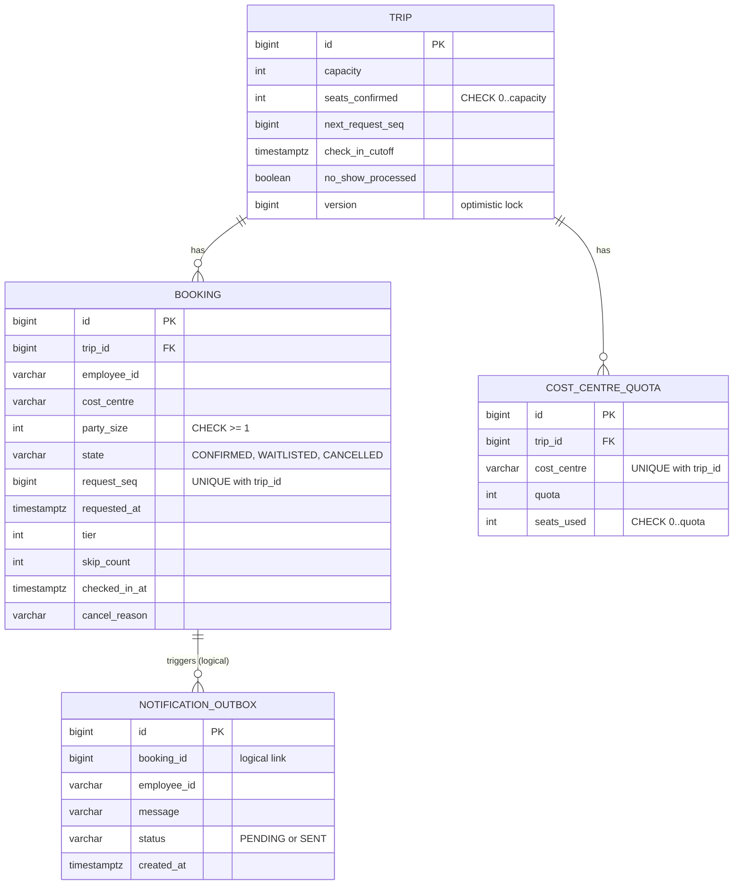

# ER Diagram

The same diagram as Mermaid (GitHub renders this natively):

```mermaid
erDiagram
    TRIP ||--o{ BOOKING : "has"
    TRIP ||--o{ COST_CENTRE_QUOTA : "has"
    BOOKING ||--o{ NOTIFICATION_OUTBOX : "triggers (logical)"

    TRIP {
        bigint id PK
        int capacity
        int seats_confirmed "CHECK 0..capacity"
        bigint next_request_seq
        timestamptz check_in_cutoff
        boolean no_show_processed
        bigint version "optimistic lock"
    }
    COST_CENTRE_QUOTA {
        bigint id PK
        bigint trip_id FK
        varchar cost_centre "UNIQUE with trip_id"
        int quota
        int seats_used "CHECK 0..quota"
    }
    BOOKING {
        bigint id PK
        bigint trip_id FK
        varchar employee_id
        varchar cost_centre
        int party_size "CHECK >= 1"
        varchar state "CONFIRMED, WAITLISTED, CANCELLED"
        bigint request_seq "UNIQUE with trip_id"
        timestamptz requested_at
        int tier
        int skip_count
        timestamptz checked_in_at
        varchar cancel_reason
    }
    NOTIFICATION_OUTBOX {
        bigint id PK
        bigint booking_id "logical link"
        varchar employee_id
        varchar message
        varchar status "PENDING or SENT"
        timestamptz created_at
    }
```
